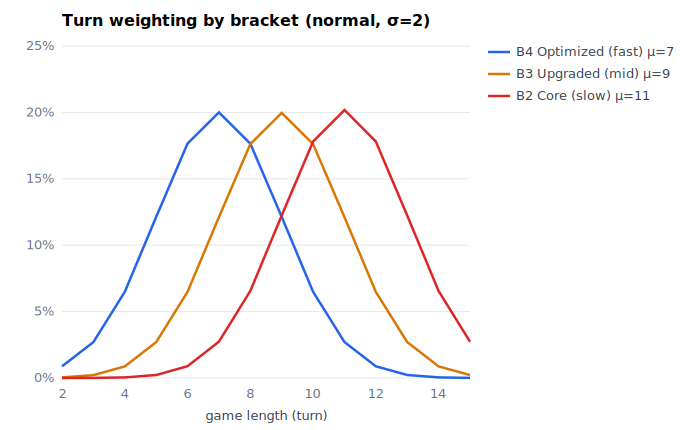

# edh-sim — optimal Commander mana curves

A Monte Carlo simulator + local-search optimizer for **Magic: the Gathering
Commander** mana curves. It starts as a faithful reimplementation of Frank
Karsten's [*"What's an Optimal Mana Curve and Land/Ramp Count for Commander?"*
(ChannelFireball, 2025)](https://www.tcgplayer.com/content/article/What-s-an-Optimal-Mana-Curve-and-Land-Ramp-Count-for-Commander) — reproducing his published table from the article's prose
— then **extends past his goldfish** with the things that actually shape a
Commander deck: **interaction (board wipes), a per-bracket "lethal board" cap (the
board you need to be a game-winning threat), a value-maximizing play policy (bin-
pack), card draw, a swept game-length horizon, and per-bracket curves.**

The whole per-game engine is `@njit`-compiled (Numba). Throughput ~1M games/s for
the bare Karsten model, ~0.4M/s (~230 ns/turn) for the full model (wipes + cap +
draw + bin-pack play).

---

## Results — mana curves by Commander bracket

Game length is the biggest lever on the curve, and it tracks deck power. We
optimize the deck at each horizon **T = 2–15**, then fold the per-horizon optima
into **per-bracket curves** via a normal weighting centered on each bracket's
characteristic game length (game length midpoints: B4 ≈ 7, B3 ≈ 9, B2 ≈ 11 turns; **σ =
1.5**):



Format `[1d(1-drop) 2d 3d 4d 5d 6d | Draw | Signets | Lands]`, **+ 1 Sol Ring** in every
deck (99 cards). "Draw" = a card-draw spell (pay X, draw X); "Signets" = any
2-mana rock. Deep converged run: 16 restarts, 1.2M-game final showdown. **Each
bracket runs its own cap + wipe timing** (higher power = smaller lethal board,
earlier interaction): **B4 cap 12 / wipe T3, B3 cap 15 / wipe T5, B2 cap 18 / wipe
T7** — see [the model](#the-model).

### Bracket 4 — Optimized (fast, ~7-turn games · cap 12 · wipe from T3)
| Cmdr MV | 1d | 2d | 3d | 4d | 5d | 6d | Draw | Sig | Land |
|:---:|:--:|:--:|:--:|:--:|:--:|:--:|:----:|:---:|:----:|
| 2 | 16 | 0 | 23 | 13 | 2 | 1 | 0 | 0 | 43 |
| 3 | 17 | 20 | 0 | 14 | 3 | 1 | 0 | 0 | 43 |
| 4 | 19 | 20 | 15 | 0 | 3 | 0 | 0 | 0 | 41 |
| 5 | 16 | 20 | 15 | 6 | 0 | 0 | 0 | 0 | 41 |
| 6 | 13 | 19 | 15 | 9 | 1 | 0 | 0 | 1 | 40 |

### Bracket 3 — Upgraded (mid, ~9-turn games · cap 15 · wipe from T5)
| Cmdr MV | 1d | 2d | 3d | 4d | 5d | 6d | Draw | Sig | Land |
|:---:|:--:|:--:|:--:|:--:|:--:|:--:|:----:|:---:|:----:|
| 2 | 10 | 0 | 20 | 14 | 8 | 2 | 3 | 0 | 41 |
| 3 | 10 | 18 | 0 | 15 | 8 | 2 | 3 | 0 | 42 |
| 4 | 11 | 18 | 16 | 0 | 8 | 2 | 2 | 0 | 41 |
| 5 | 11 | 19 | 15 | 9 | 0 | 1 | 2 | 0 | 41 |
| 6 | 9 | 15 | 14 | 11 | 3 | 0 | 2 | 3 | 41 |

### Bracket 2 — Core (slow, ~11-turn games · cap 18 · wipe from T7)
| Cmdr MV | 1d | 2d | 3d | 4d | 5d | 6d | Draw | Sig | Land |
|:---:|:--:|:--:|:--:|:--:|:--:|:--:|:----:|:---:|:----:|
| 2 | 5 | 0 | 18 | 13 | 9 | 3 | 9 | 0 | 41 |
| 3 | 4 | 14 | 0 | 16 | 9 | 4 | 9 | 0 | 42 |
| 4 | 5 | 14 | 15 | 0 | 10 | 4 | 8 | 1 | 41 |
| 5 | 5 | 15 | 14 | 11 | 0 | 4 | 7 | 1 | 41 |
| 6 | 5 | 11 | 12 | 12 | 6 | 0 | 8 | 4 | 40 |

**Read across the brackets:**
- **Fast (B4):** a **cheap creature curve** (13–19 one-drops), ~0 ramp/draw — the
  small cap-12 board is trivial to rebuild with cheap creatures, so drawing/ramping
  only *delays* re-hitting the cap.
- **Slow (B2):** 1-drops thin out to **4–5**, and a **~7–9 card-draw** engine +
  signets (up to ~4–6 at MV 6) appears — a resilient deck that rebuilds an *18*-mana
  board from hand after each wipe. Draw grows with the cap/game length (0 in B4 →
  ~2–3 in B3 → ~7–9 in B2).
- Lands hold **~39–43** throughout.
- The `0` on the diagonal is **Karsten's Insight #2** (no drops at the commander's
  own mana value) — the free commander already fills that slot. It breaks only at
  MV 6: 6 is the model's ceiling (no 7+ drops), and you keep a *stock* of top-end
  to rebuild after wipes.
- **Draw cards are cheap cantrips:** cast at an average **X ≈ 2.3** (~56% at
  X = 1) — a 1-mana leftover-mana filter, with a ~10% tail of big post-wipe digs
  (X ≥ 6).

> ⚠️ **Draw is under-counted in the high brackets.** The fast tables (Optimized /
> cEDH) show ~0 draw, but that's a model artifact: the compounded-board-mana
> criterion has no notion of **digging for answers or combo pieces to win** —
> which is the whole reason high-power decks run heavy card selection. Real
> Optimized/cEDH decks want far more draw than the board-mana metric rewards.

**The cap is the biggest lever — and it's what separates the brackets.** The
per-turn development cap = *how much board that power level needs to be lethal*
(below). A **low cap (B4 = 12)** rebuilds to lethal with a couple of cheap
creatures → cheap curve, no draw/ramp; a **high cap (B2 = 18)** needs ~3 big drops to be lethal making a draw + ramp engine to assemble and re-assemble it after
each wipe. So the fast → slow gradient is really *cap 12 → 18*: draw climbs from 0
to ~10 and 1-drops fall from ~17 to ~4 as the cap rises.

---

## The model

### Criterion & deck
- **Deck** = `[1,2,3,4,5,6-drop, Signet, Land, Draw]` (the Draw slot is optional)
  summing to 98, plus one implicit **Sol Ring** → 99 cards. The **commander** is a
  free MV-N spell in the command zone (cast once; recastable after a wipe).
- **Criterion** = expected *compounded board mana*. At each turn end, sum the mana
  worth of on-board non-rock, non-land permanents, then **cap it** per turn
  (`min(·, cap)`, cap per-bracket — below). A k-drop is worth k; a **six-drop is
  6.2** (Karsten's super-linear premium); the commander is scored the same (raw MV
  for 1–5, **6.2 at MV 6**). Rocks, lands, and draw spells score 0. The horizon T
  (turns summed) is a parameter — Karsten's base is 7; we sweep **2–15**.
- Multiplayer rules: **free first mulligan**, **always on the draw**, London
  bottoming.

### The full model (beyond Karsten's goldfish)
- **Board wipes** (interaction): each turn ≥ `wipe_start`, wipe chance `0.10 ×
  1.2^(wipe-free turns)`. A wipe kills creatures and sends the commander to the
  command zone, but **rocks, lands, and your hand survive** — so you rebuild from
  the hand that survived (this is what makes ramp and draw earn their keep).
  `wipe_start` is **per-bracket** — higher-power tables hold up interaction earlier:
  **B4 = T3, B3 = T5, B2 = T7**.
- **Development cap — the lethal board (this is how synergy is modeled).** Each turn
  contributes `min(board value, cap)`. The cap = *how much board this power level
  needs to be a game-winning threat* — a board that's **about to win, held off by a
  stopper**. It's worth the max (it's lethal), but no more (someone is stopping the
  actual win), so beyond the cap you **hold the rest of your hand** for interaction,
  protection, and post-wipe redevelopment (held cards survive the wipe). Higher
  power ⇒ a *smaller* lethal board ⇒ a *lower* cap:
  **B4 = 12** (a fair 2-card combo, e.g. Kiki-Jiki + Zealous Conscripts),
  **B3 = 15** (3–4 cards of real synergy), **B2 = 18** (~3 random six-drops). It's
  why the slow bracket wants a draw engine but few creatures: reach a lethal board,
  then keep cards to defend and rebuild it, not overextend into the next Wrath.
- **Play policy — bin-pack, not greedy.** Each turn, after ramp (land / Sol Ring /
  signets, played greedily), the remaining mana is spent by a bounded-knapsack that
  **maximizes the value it adds** (`min(Σ value, cap − board)`), breaking ties by
  playing the **fewest cards** (hold the rest). It may overshoot the cap with one
  card to reach it. This replaces a greedy highest-first dump (which stranded mana —
  playing a 4-drop with 2 mana left over instead of two 3-drops). At the optimum the
  two nearly coincide (the optimizer already picks gap-free cheap curves), but the
  pack is correct on any deck and ~30% *faster* than the old greedy.
- **Card draw:** a pay-X-draw-X spell, played *last*, only when your hand is below
  7 cards (or you're stuck with nothing else castable — a rare dig).
- **Optimizer:** *explore-cheap → select-precise* — many cheap local-search
  restarts explore, then the unique finalists get one high-sim showdown on a
  shared seed. This avoids the max-of-noisy-estimates bias of naive best-of-N.

### Chosen constants (magic numbers — not fit to data)
These are hand-picked and tunable, not derived:

| Constant | Value | Basis |
|---|---|---|
| score cap (lethal board) | **B4 12 / B3 15 / B2 18** | chosen — smaller lethal board at higher power |
| wipe start turn | **B4 3 / B3 5 / B2 7** | chosen — earlier interaction at higher power |
| wipe chance | **10% base, ×1.2/wipe-free turn** | chosen |
| weighting σ | **1.5** | chosen (pointier = fewer tail games) |
| six-drop / MV-6 cmdr | **6.2** | Karsten's experience-based super-linear premium |

---

## The mulligan (attempt at Karsten's open problem)

Karsten flagged the optimal mulligan as future work. We attack it with
**value-function dynamic programming** (keep hand *h* iff its simulated value ≥ the
value of mulliganing again; backward induction), then distill the result into a
fast rule:

> **Keep 3–4 lands. Mull the fifth (flood).** 2 lands only with a mana rock, 1
> only behind a Sol Ring. Fast decks also want ≥ 1 non-rock play.

This *tightened* the classic "keep 3–5 lands" (5-land hands flood), and on the
pre-wipe model it beat his heuristic at every horizon, shifting decks toward more
lands / fewer rocks (a smarter mulligan handles flood, so rocks aren't needed as
land-consistency insurance). **Not fully solved:** the DP is optimal only for the
*simplified* value function; the distilled rule above is a lossy approximation of
it and hasn't been re-derived for the full (wipe/cap/draw) model — which reuses
the same rule. Full derivation: [`docs/methodology.md`](docs/methodology.md).

---

## Methods

- **Common random numbers (CRN):** within each optimizer iteration, every candidate
  deck is scored on the *same* batch of game seeds, so luck (esp. Sol Ring)
  cancels in the comparison — a variance-reduction fix for the noise Karsten
  flagged. Seeds refresh each iteration (no seed overfit).
- **Cumulative sim:** one game to the max horizon records the criterion at every
  turn, so a single pass yields *all* horizons — a horizon-T game is the
  horizon-(T+1) game truncated.
- **Numba engine:** removes his multi-day runtime — a 2M-game evaluation is ~2 s
  for the bare model, ~4 s for the full model (~230 ns/turn).

---

## Usage

```bash
uv sync
make test                           # 63 fast tests
make lint                           # ruff + 500-line file cap
uv run pytest -m slow               # Monte Carlo / optimizer anchors (~3.5 min)

# FULL model (wipes + cap + draw + bin-pack), one bracket (e.g. B4 = cap 12, wipe T3):
uv run python run_final.py --seed-json <seed.json> --restarts 16 --final-sims 1200000 \
    --cap 12 --wipe-start 3 --turns-min 4 --turns-max 10

# FAITHFUL Karsten base (7-turn goldfish, no wipes/cap/draw):
uv run python main.py run           # optimize all 5 commander MVs -> table
uv run python main.py validate      # criterion vs his 72.465 checkpoint

# analysis: horizon sweep, self-pacing overnight runner, value-function mulligan DP:
uv run python sweep.py --turns-min 2 --turns-max 15
uv run python -c "import mulligan"
```

## Project layout

| File | Role |
|---|---|
| `cards.py` | card codes, seedable PRNG, library construction |
| `sim_core.py` | `@njit` engine: mulligan, gameplay, wipes, scoring, cumulative sim, draw-stats |
| `binpack.py` | `@njit` bounded-knapsack play policy (value-max mana spend, hold the rest) |
| `optimizer.py` | local search + CRN, explore-cheap→select-precise, joint sweep, neighborhoods |
| `run_final.py` | full-model per-bracket runner (per-cell crash-safe save) |
| `main.py` / `sweep.py` / `overnight.py` / `mulligan.py` | faithful CLI / horizon sweep / self-pacing runner / mulligan DP |
| `docs/` | methodology, design spec, bracket-weighting graph |

---

## Applying this to real decks

An idealized curve model, not gospel. In practice: cut a land per 2–3 mana rocks
(or per 3–4 cantrips / mana dorks) but don't go below ~37; treat `Cultivate` as
rock + 3-drop, `Llanowar Elves` as rock + 1-drop, an MDFC land as half-land; run
fewer 1-drops if you have many tapped lands. And don't chase the tables exactly —
aggro wants a lower curve, control a higher one, and real synergy beats raw curve.
